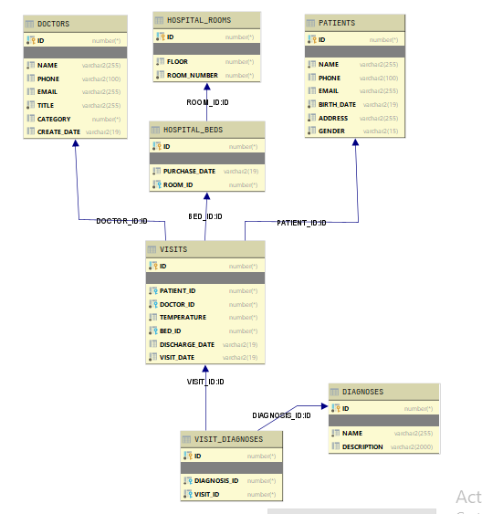

# Term paper Oracle data base

## Install

- [Oracle 18c XE](https://www.oracle.com/database/technologies/appdev/xe.html)

⚠️ [Docker](https://github.com/oracle/docker-images/) prints many errors during the build and install image.



## Setup data base

```sql
# First run login (admin login)
$ sqlplus sys/GetStarted18c@//localhost:1521/XEPDB1 as sysdba
# create user - "alex" with pwd "admin" 
$ CREATE USER alex IDENTIFIED BY admin;
$ @.\user_permissions.sql

# Set flag for translated version of Oracle
$ set NLS_LANG=.AL32UTF8
# SQL Plus login 
$ sqlplus alex/admin@//localhost:1521/XEPDB1

# create table order
@.\schema\doctors.sql;
@.\schema\patients.sql;
@.\schema\hospital_rooms.sql;
@.\schema\hospital_beds.sql;
@.\schema\diagnoses.sql;
@.\schema\visits.sql;
@.\schema\visit_diagnoses.sql;

# drop table order
DROP TABLE Visit_Diagnoses;
DROP TABLE Visits;
DROP TABLE Patients;
DROP TABLE Doctors;
DROP TABLE Diagnoses;
DROP TABLE Hospital_Beds;
DROP TABLE Hospital_Rooms;
```